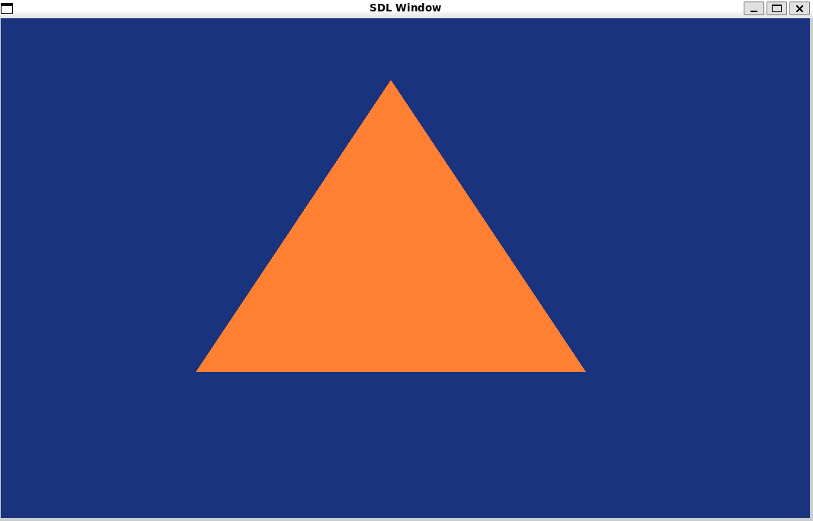

# Bindings for OpenGL in Mojo
This library generates and provides bindings for OpenGL in mojo.
This code is far from production ready, so if you find any issues, please open a github issue.

## Building

`pixi run build` - Generate the mojo package with bindings.

## How to use
To run opengl in mojo, you need to have a windowing system.
For example, you can use [SDL3 bindings](https://github.com/MojoGameDevs/sdl-mojo). To reference `sdl` and `opengl` packages, you have to place them into your project like a submodule.

### Example output for a Basic Triangle Shader

